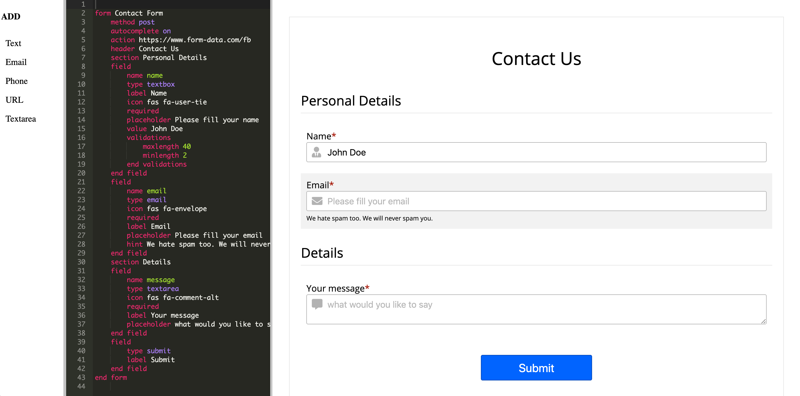

# What is Form-Builder

There are dozens of form builders out there. This one is different in that it doesn't ask you to fill in forms in order to create forms.
It is directed toward people (mostly developers I guess) who feel confortable with writing text and not using drag-and-drop fancy UI. The text is plain english and does not requires learning any new language.

## Why Do I need it? I can just write the HTML
Forms may seem simple to create, but there are a lot of things you need to know when you create them. Just to name a few:
* Responsive design
* Input validation
* Pop the right keyboard on mobile (with ".com" for email fields, with number pad for phone fields, etc)
* Have the right UX - Put hints at the right place, icons, readable labels, etc
* A11y - There are a lot of things you need to know in order to make your forms accessible. Screen readers should get all the right structure and hints, people that use larger fonts should be respected, etc.

## What can I do with it?
1. You start with a given template
2. Change it however you want
3. Grap the resulting HTML and paste it in your web site

That's it. You can modify the HTML if you don't like it. 

## Can I control the design of the form?
Currently there is only one theme, but we do plan adding new ones in the future. 
The default theme is classic - simple and pleasent. You can add css to your site to change the default theme as you wish.

## How does it play with the framework that I use on my site?
The resulting forms do not have any dependency on any external css library or js library. It's a complete stand alone solution you can drop into your site, no matter what libraries or frameworks you use.

## How can I handle the submissions?
If you have your own site backend that you're happy with - great, just use it.
You can also use [form-data](https://www.form-data.com) - forms backend service that handle the submissions, does spam filter, auto-respond to your users, sends you notifications, and more.

## Enough talking, I want to see it
Just go to [the builder](./src/index.html)
